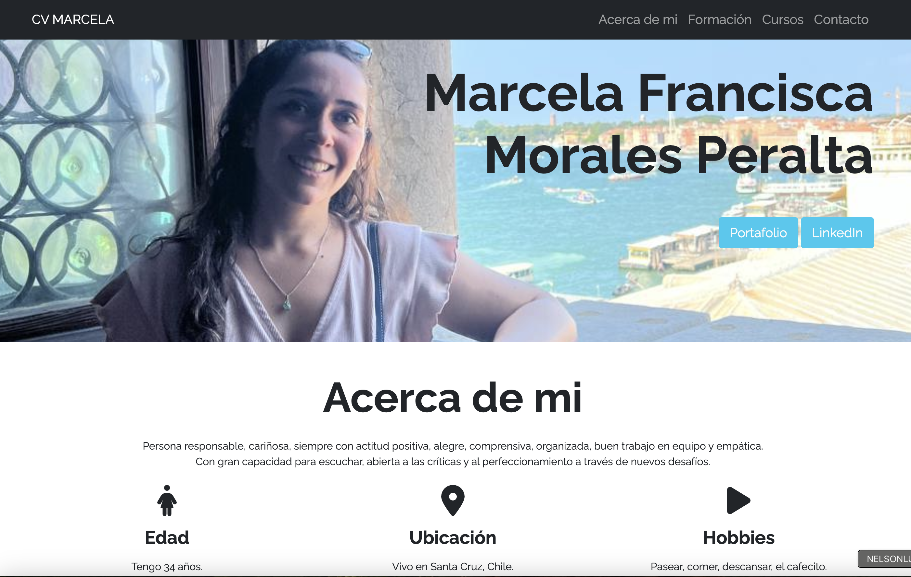

# Prueba desarrollo portafolio.

## Pasos que se siguieron:
- Creación de curriculum y portafolio

- Creación del proyecto a github pages, el enlace es https://marcemorales.github.io/Prueba-portafolio/

## Forks y commit realizados:

### Primer Fork y commit:
Realizado a Sebastián León repositorio original: https://github.com/AstronaveCometa/CurriculumVitae

Repositorio forkeado: https://github.com/marcemorales/CurriculumVitae

- Se creó la carpeta assets y dentro de ella se creó carpeta css y img

- Se cambiaron las rutas de las imágenes y del css en el index, ya que estas no coincidian al haberse creado carpetas para estas

### Segundo Fork y commit:
Realizado a xxx repositorio original:

Repositorio forkeado:

- 